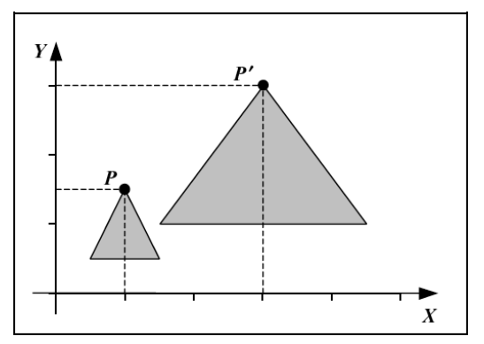
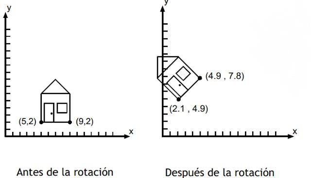
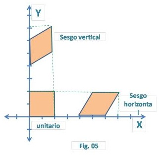
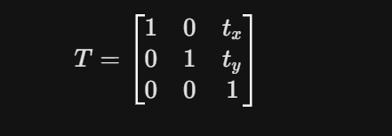
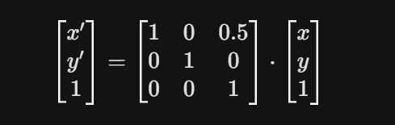
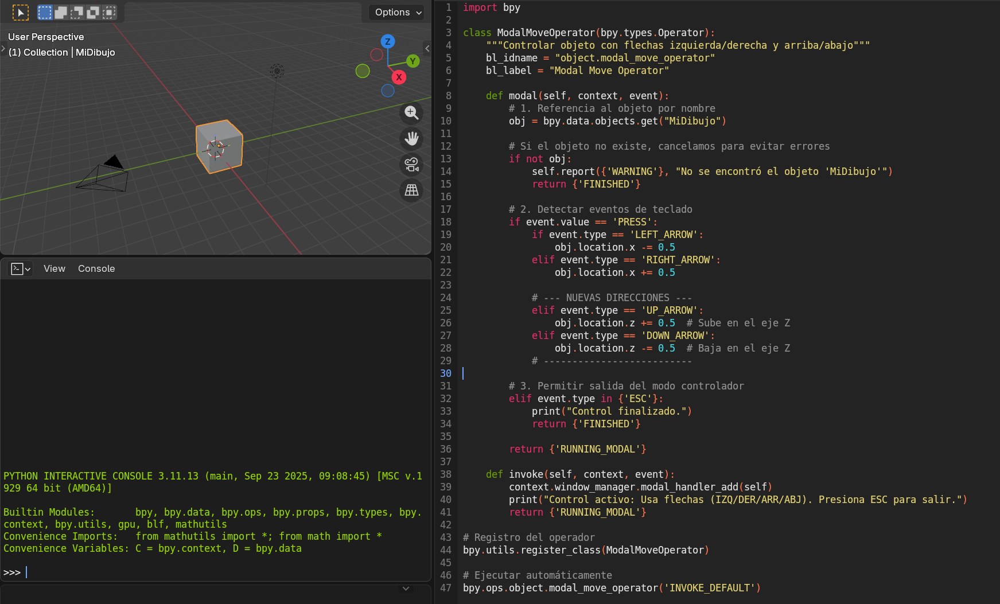
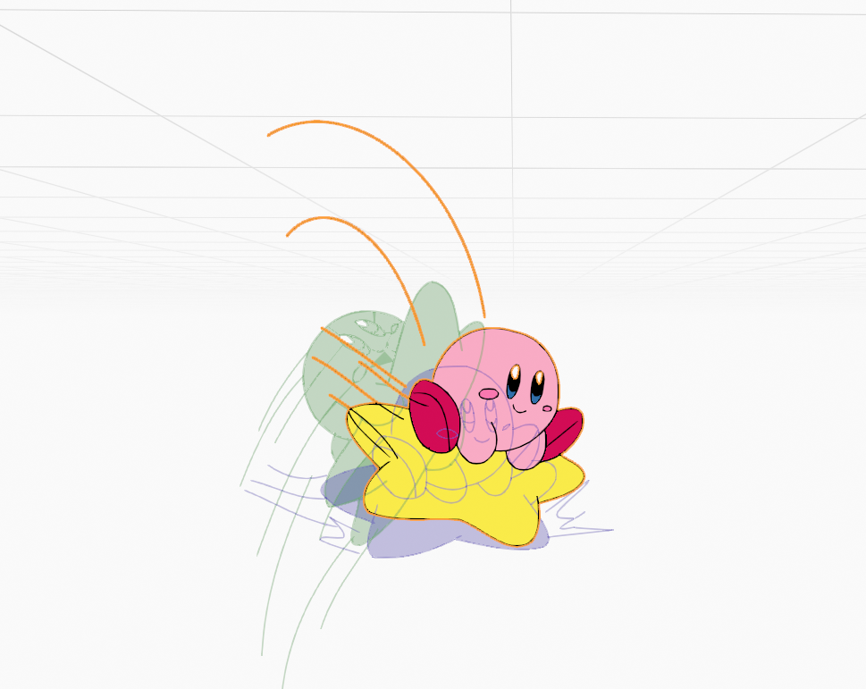
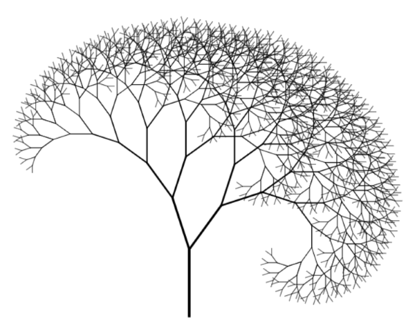
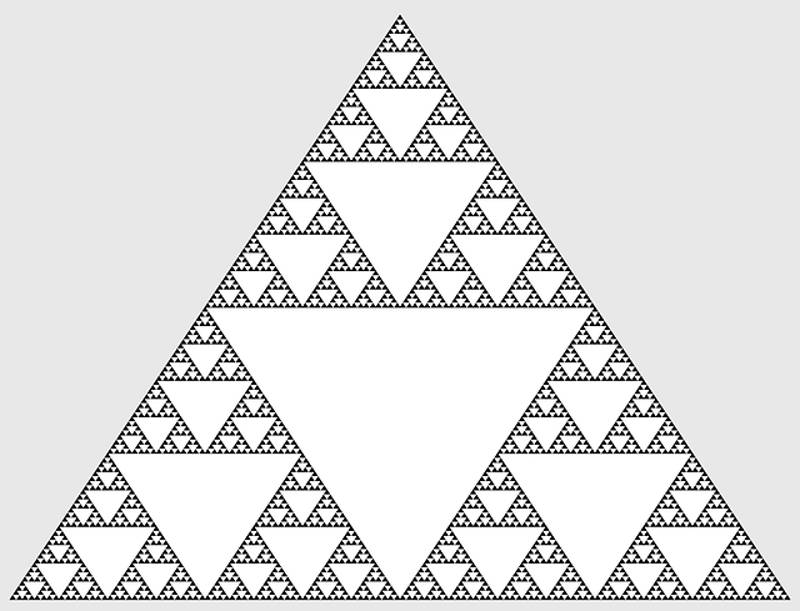
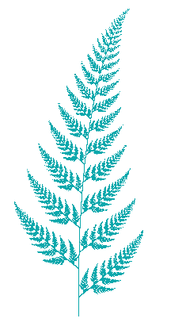

# Unidad2

## Contenido de la Unidad
### 2.1. Transformación bidimensional.

   * 2.1.1. Traslación.

   * 2.1.2. Escalamiento.

   * 2.1.3. Rotación.

   * 2.1.4. Sesgado.

### 2.2.Representación matricial de las transformaciones
bidimensionales.
### 2.3. Trazo de líneas curvas.

   * 2.3.1. Bézier.

   * 2.3.2. B-spline.
### 2.4. Fractales
### 2.5. Referencias bibliográficas.

### 2.1. Transformación bidimensional.
Se define como una función o mapeo que traslada un punto P(x, y) a una nueva posición P'(x', y'). Estas operaciones permiten ajustar los componentes de una imagen en sus posiciones apropiadas mediante procesos de traslación, rotación, escalamiento y sesgado. La capacidad de procesar estas transformaciones de manera eficiente depende de su formulación matemática, la cual se ha estandarizado a través del uso de matrices y coordenadas homogéneas.
* 2.1.1. La Traslación como Desplazamiento Lineal
La traslación es la operación más fundamental, consistente en mover un objeto siguiendo una trayectoria recta desde una ubicación de coordenadas a otra. Matemáticamente, se efectúa sumando constantes de desplazamiento t_x y t_y a las coordenadas originales del punto P :x' = x + t_xy' = y + t_y Este proceso, a menudo descrito coloquialmente como "deslizar" la figura, mantiene la orientación y el tamaño del objeto inalterados, preservando todas las propiedades geométricas internas. En aplicaciones prácticas, la traslación de una línea se realiza aplicando la operación únicamente a sus puntos extremos, mientras que para polígonos se aplica a cada uno de sus vértices. Un aspecto crítico en la implementación es el manejo de los límites del dispositivo; si un objeto se traslada más allá del área visible, el sistema debe ser capaz de realizar procesos de recorte o emitir mensajes de error para evitar distorsiones en la memoria de video.

* 2.1.2. Escalamiento y Proporciones Geométricas
El escalamiento permite alterar el tamaño de un objeto mediante la multiplicación de sus coordenadas por factores de escala específicos s_x y s_y. La naturaleza del escalamiento depende de la relación entre estos factores. El escalamiento uniforme se presenta cuando s_x = s_y, lo que garantiza que el objeto conserve su forma original y sus proporciones relativas, variando únicamente su magnitud espacial. Por el contrario, el escalamiento diferencial ocurre cuando s_x \neq s_y, lo que introduce una distorsión en la forma, convirtiendo, por ejemplo, un cuadrado en un rectángulo o un círculo en una elipse. Los valores de los factores de escala determinan el efecto visual: valores superiores a 1 producen un agrandamiento, mientras que valores entre 0 y 1 resultan en una reducción del tamaño. Es fundamental señalar que el escalamiento estándar se realiza con respecto al origen de coordenadas, lo que implica que el objeto no solo cambia de tamaño sino que también se desplaza en el plano a menos que se aplique una técnica de punto fijo.

* 2.1.3. Rotación y Orientación Angular
La transformación de puntos de un objeto situados en trayectorias circulares es llama rotación. Este tipo de transformación se especifica con un ángulo de rotación, el cual determina la cantidad de rotación de cada vértice de un polígono. 
Se pueden hacer que los objetos giren alrededor de un punto arbitrario o el punto pivote de la transformación de rotación puede colocarse en cualquier parte en el interior o fuera de la frontera exterior de un objeto, el efecto de la rotación consiste en oscilar el objeto con respecto a este punto interno. 
Para rotar un objeto (en este caso bidimensional), se ha de determinar la cantidad de grados en la que ha de rotarse la figura. Para ello, y sin ningún tipo de variación sobre la figura, la cantidad de ángulo ha de ser constante sobre todos los puntos. 

Los puntos también pueden ser rotados un ángulo θ con respecto al origen.
Ejemplo En la figura se muestra la rotación de la casa 45º, con respecto al origen.

 * 2.1.4. Sesgado
El sesgado es una transformación que deforma la apariencia de un objeto de tal manera que este parece haber sido deslizado en capas. A diferencia de la rotación o la traslación, el sesgado no preserva la forma original, por lo que se clasifica como una transformación no rígida.

Existen dos modalidades principales de esta operación:

1. Sesgo horizontal:Las coordenadas adyacentes al eje x permanecen fijas, los valores de y no cambian. 
2. Sesgo vertical: Las coordenadas adyacentes al eje y permanecen fijas, los valores de x no cambian.
   

### 2.2.Representación matricial de las transformaciones
En el script desarrollado, cada vez que presionamos una flecha del teclado, estamos aplicando una Traslación. En computación gráfica, una traslación en un plano 2D se representa mediante una matriz de transformación de 3 x 3 (usando coordenadas homogéneas).
  1. La Matriz de TraslaciónPara mover un objeto a una nueva posición, multiplicamos el vector de posición original del objeto por una matriz de traslación T:
     
     Donde:
     Tx: Es el desplazamiento en el eje X (en nuestro código, 0.5 o -0.5).
     ty: Es el desplazamiento en el eje vertical (en el caso de Blender, aunque usamos el eje Z para "arriba", matemáticamente en un plano 2D se documenta como el segundo componente de traslación).
     
 2. Aplicación en el CódigoCuando el script ejecuta la línea obj.location.x += 0.5, internamente ocurre la siguiente operación matricial para calcular la nueva posición (x', y'):
    
3. Correspondencia con el Script
   * Movimiento Derecha/Izquierda: Modifica el valor t_x de la matriz.
   * Movimiento Arriba/Abajo: En una representación bidimensional teórica, esto modifica el valor t_y. En nuestro script de Blender, al ser un entorno 3D, estamos afectando la componente t_z de una matriz de 4 X 4, pero el principio matemático de suma vectorial mediante producto matricial es el mismo.
  

### 2.3. Trazo de líneas curvas.
La representación de curvas suaves es un componente crítico en el diseño industrial y la tipografía digital, donde las líneas rectas resultan insuficientes para capturar la complejidad de las formas. Las curvas paramétricas, como las de Bézier y las B-splines, ofrecen un método matemático preciso para definir trayectorias fluidas mediante un conjunto de puntos de control.

* 2.3.1. Bézier.
Las curvas de Bézier se fundamentan en los polinomios de Bernstein, los cuales actúan como funciones de mezcla para determinar la influencia de cada punto de control en la forma final de la curva. Una curva de Bézier de grado n está definida por n+1 puntos de control P_i.

Las propiedades fundamentales de estas curvas incluyen :
 1. Interpolación de puntos finales: La curva siempre comienza exactamente en P_0 y termina en P_n.
 2. Control tangencial: La dirección de la curva en los extremos está determinada por los segmentos P_0-P_1 y P_{n-1}-P_n.
 3. Envolvente convexa: Toda la curva reside dentro del polígono convexo formado por sus puntos de control, lo que proporciona una garantía geométrica para algoritmos de renderizado y colisiones.
 4. Control global: Esta es una de sus principales desventajas en el diseño complejo; si se mueve un solo punto de control, la forma de toda la curva se ve afectada, lo que limita la capacidad de realizar ajustes locales.

El algoritmo de De Casteljau proporciona una forma geométrica e iterativa de calcular puntos sobre la curva sin evaluar directamente los polinomios, facilitando su implementación en hardware y software gráfico.

  
 * 2.3.2. B-spline.
  Una B-spline es una curva paramétrica utilizada en computación gráfica para generar trazos suaves y continuos a partir de un conjunto de puntos de control.
Para nuestra animación de Kirby
1. Puntos de Control: Son las posiciones del centro de Kirby en nuestras Poses Clave (Contacto, Down, Passing, Up).
2. La Curva B-spline: Es la trayectoria invisible pero matemáticamente definida que sigue el personaje al moverse de una pose a otra.

Aplicación Práctica en Blender:
Aunque la animación es frame a frame (nosotros dibujamos las poses), Blender utiliza curvas B-splines (o curvas Bezier muy similares) en su motor de interpolación interna para calcular los fotogramas intermedios (Inbetweens).

 * Trayectoria del Rebote: Al definir los puntos clave de altura máxima (Up) y contacto con el suelo (Down), Blender genera una curva B-spline parabólica. Esto asegura que Kirby no se mueva en líneas rectas y rígidas, sino siguiendo un arco suave, esencial para la física de un rebote natural.

* Manejo del Tiempo (Timing/Spacing): Las B-splines permiten controlar la aceleración y desaceleración. Cerca de los puntos de control de "Down" (impacto), la curva es más pronunciada, indicando un cambio rápido de velocidad. Cerca del punto "Up" (pico del salto), la curva es más plana, lo que se traduce en que Kirby "flota" un instante antes de caer.

El uso de interpolación basada en principios de B-splines es crítico para este proyecto porque:

Suaviza la Transición: Elimina el movimiento robótico que ocurriría con una interpolación lineal simple entre dibujos.

Automatiza la Física: Permite que la computadora calcule la trayectoria curva correcta, permitiéndonos concentrarnos en el acting del personaje (ojos, expresión, Squash & Stretch) en cada fotograma dibujado.

### 2.4. Fractales
Representa una ruptura con la geometría clásica euclidiana al proporcionar herramientas para describir formas irregulares y fragmentadas presentes en la naturaleza, como costas, nubes y montañas. El término fractal deriva del latín fractus, que significa quebrado o fracturado.

** Geometría Fractal
Es geometría que no distingue entre conjunto matemático y objeto natural. Este nuevo paradigma engulle paradigmas anteriores proyectando un modelo que inaugura una nueva zona o región de lo real. Tómese un número complejo, multiplíquese por sí mismo y súmese el número inicial; tómese el resultado, multiplíquese por sí mismo, súmese el inicial y así sucesivamente. A esta iteración en principio errática se le asignan puntos sobre un plano. Disponga papel, lápiz y moneda con cara y cruz, fijemos ciertas reglas para cada lanzamiento; por ejemplo, desplazar el punto X centímetros al noreste si sale cara y acercarse un 50% al centro inicial si sale cruz. Se perfila, progresiva y sorprendentemente el dibujo de la hoja de helecho mientras el ordenador hace esta tarea menos ardua en pantalla y en décimas de segundo. 

** Fractales en la naturaleza 
Las formas de la naturaleza son fractales y múltiples procesos de la misma se rigen por comportamientos fractales. Esto quiere decir que una nube o una costa pueden definirse por un modelo matemático fractal que se aproxime satisfactoriamente al objeto real. Esta aproximación se realiza en toda una franja de escalas, limitadas por valores mínimos y máximos.

### 2.5. Referencias bibliográficas.
1. Fractales. (n.d.). https://fernandez-torres-jose.blogspot.com/2012/08/fractales.html
2. Lara, J. G. (n.d.). Conceptos de: graficación en 2D, transformación bidimensional, traslación, escalación, rotación y sesgado. https://javiergarcialara.blogspot.com/2017/03/conceptos-de-graficacion-en-2d.html
3. (N.d.). Uanl.Mx. Retrieved April 3, 2026, from https://cd.dgb.uanl.mx/bitstream/handle/201504211/3090/16647.pdf?sequence=1&isAllowed=y
4. (N.d.-b). Edu.Pe. Retrieved April 3, 2026, from https://revistas.pucp.edu.pe/index.php/promathematica/article/download/8162/8457/32128
